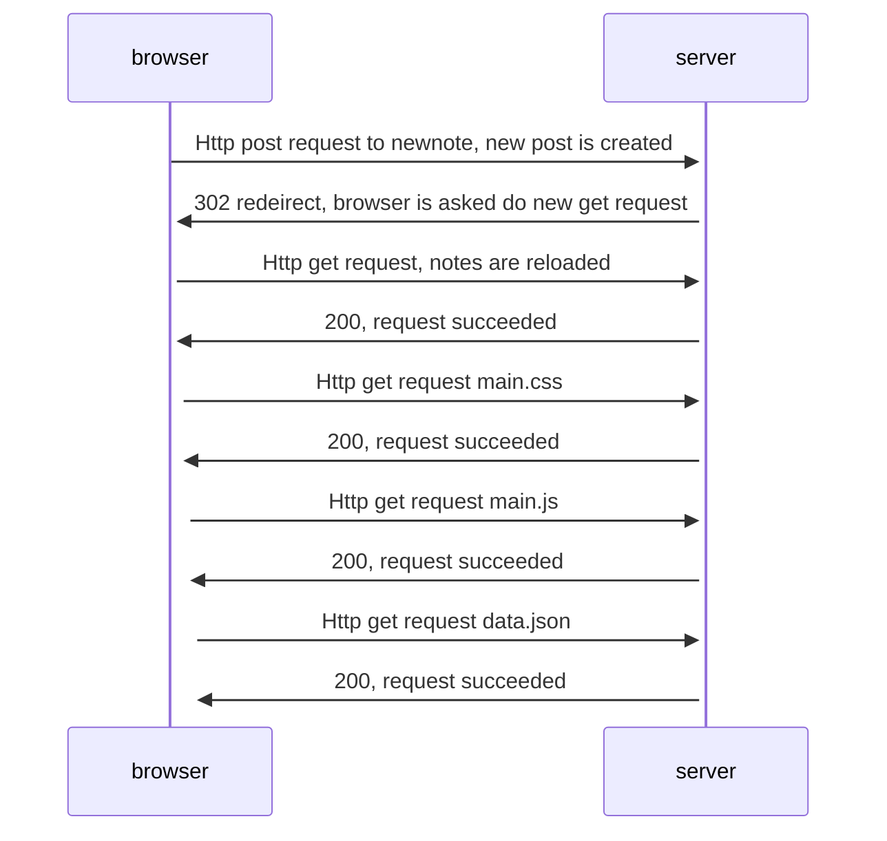

```mermaid
sequenceDiagram;
    browser->>+server:Http post request to newnote, new post is created
    server->>+browser:302 redeirect, browser is asked do new get request
    browser->>+server:Http get request, notes are reloaded
    server->>+browser: 200, request succeeded
     browser->>+server:Http get request main.css
     server->>+browser: 200, request succeeded
     browser->>+server:Http get request main.js
     server->>+browser: 200, request succeeded
     browser->>+server:Http get request data.json
     server->>+browser: 200, request succeeded
```